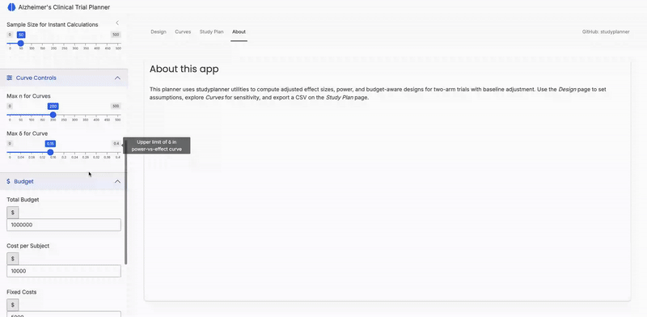
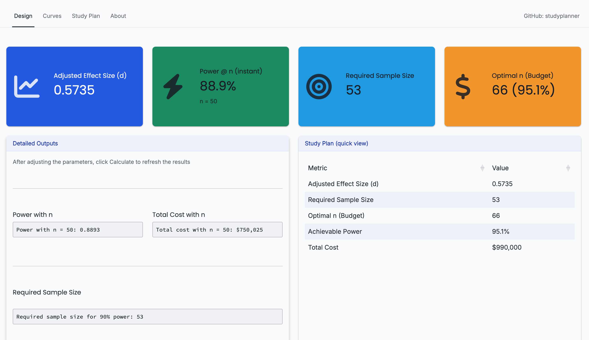
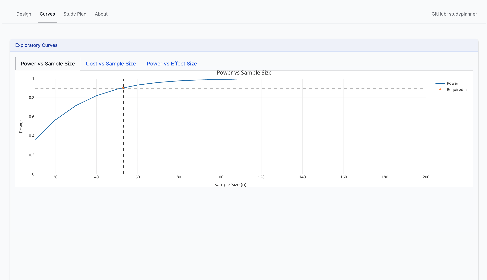
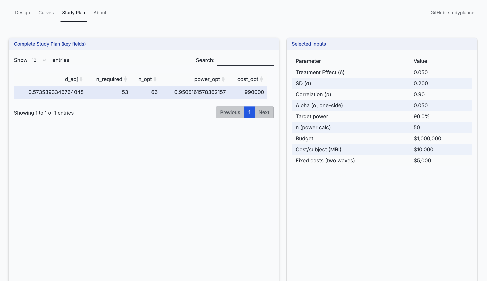

 # 🧠 Alzheimer’s Clinical Trial Planner

[Alzheimer’s Clinical Trial Planner](https://2a9j6h-liu-chunyu.shinyapps.io/studyplanner/)

An interactive **R Shiny** application for designing and optimizing **two-arm Alzheimer’s disease clinical trials** with baseline adjustment.  
The app integrates `studyplanner`-style utilities to compute **effect size, power, sample size, and budget-aware designs** through a modern web UI.

---

## 🌐 Live Demo


---

## 🖼️ Screenshots

| Home / Design tab | Curves tab | Study Plan tab |
|-------------------|------------|----------------|
|  |  |  |

> *Screenshots show power calculations, cost curves, and candidate-design summaries.*

---

## 🚀 Features

- 🎚️ **Interactive controls**: effect size (δ), variability (σ), correlation (ρ), α, target power  
- 📏 **Auto-computed**: adjusted effect size, required sample size, total cost  
- 📈 **Interactive curves** (Plotly): Power vs n, Cost vs n, Power vs δ  
- 🧮 **Candidate Design Table**: multiple (n, power, cost) options with **Within Budget** ✓/✗ and ranking  
- 💾 **Export** study plan to CSV  
- 💅 **Bootstrap 5 UI** (via `bslib`), responsive and clean

---

## 🧩 Requirements

### 1) R Version
R ≥ **4.2.0** (recommended 4.3+)

### 2) Install Dependencies
```r
install.packages(c(
  "shiny", "bslib", "DT", "plotly", "ggplot2", "shinycssloaders"
))
```

### 3) (Optional) `studyplanner`
```r
devtools::install_github("chunyu-yes/studyplanner", subdir = "studyplanner")
```
---

## ▶️ Run Locally

```r
# Option A: run from a parent directory by specifying path
shiny::runApp("path/to/your/app/folder")

# Option B: if your main file is app.R and you're already in that directory
shiny::runApp()
```

The app opens in your browser at a local `http://127.0.0.1:XXXX`.

---

## 📖 Usage Guide

1. **Set parameters** in the left sidebar  
   - **Effect Size**: δ (treatment effect), σ (SD), ρ (baseline–follow-up correlation)  
   - **Statistics**: α (two-sided), target power, and a quick-check sample size *n*  
   - **Budget**: total budget, per-subject cost, fixed costs  
   - **Curves**: n-range limit (`n_max`) and δ-range limit (`delta_max`)  
   - **Design Table Controls**:  
     - *Candidate n step*: grid step for candidate sample sizes  
     - *Show only rows within budget (✓)*: filter feasible designs
2. Click **Calculate** to update metrics, curves, and tables.
3. **Design tab**: value boxes + detailed outputs.  
4. **Curves tab**: three interactive plots (Power vs n, Cost vs n with budget line, Power vs δ with target-power line).  
5. **Study Plan tab**: a **Candidate Designs** table listing (n, power, total cost, budget flag, rank); select a row to review.  
6. Use **Download Study Plan (CSV)** to export key metrics.

---

## 🧮 Core Calculations

> Implemented by (or compatible with) `studyplanner` utilities.

| Function | Purpose |
|---------|---------|
| `effect_size_adj(delta, sigma, rho)` | Baseline-adjusted standardized effect size *d* |
| `power_two_arm(d, n, alpha)` | Power for a two-arm comparison (two-sided α) |
| `sample_size_two_arm(d, alpha, target_power)` | Required *n* to achieve target power |
| `study_cost(n, cost_per_subject, fixed_costs)` | Total cost = fixed + variable (n × per-subject) |
| `optimize_under_budget(d, alpha, budget, cost_per_subject)` | Returns the best *n* and expected power under a budget |
| `study_planner(...)` | Convenience wrapper assembling the above into a plan list |

---

✅ *Created with R Shiny and Bootstrap 5.*  
💬 Feedback and issues are welcome via the GitHub **Issues** tab.
